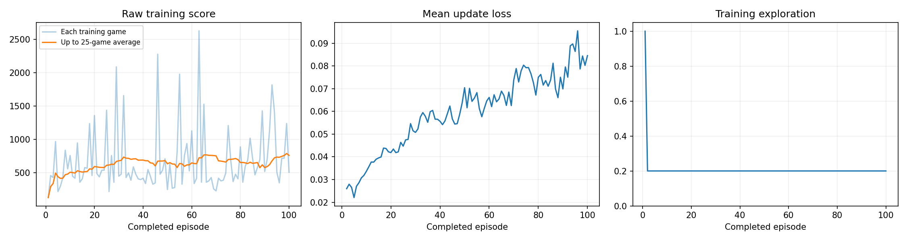
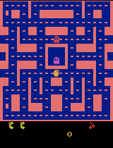
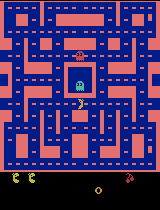

# Ms. Pac-Man Deep Q-Network (DQN) Agent

This repository contains the executed notebook, evaluation scores, training plots, gameplay GIFs, and model checkpoints for the Ms. Pac-Man RL assignment.

## 1. Evaluation Scores (Five Scores Before vs After)

| Game | Before Training | After Training |
| :--- | :--- | :--- |
| **Game 1** | 350 | 310 |
| **Game 2** | 500 | 230 |
| **Game 3** | 320 | 230 |
| **Game 4** | 800 | 390 |
| **Game 5** | 490 | 200 |
| **Mean** | **492.0** | **272.0** |

## 2. Training Plot

## 3. Gameplay Demonstration (GIFs) & Checkpoints

### Untrained vs Best Trained Agent
| Untrained Agent (Episode 0) | Best Trained Agent |
| :---: | :---: |
|  |  |

### Intermediate Gameplay GIFs
* **Episode 25:** 
* **Episode 50:** 
* **Episode 75:** 
* **Episode 100:** 

### Model Checkpoints
* Saved weights: `episode_0025.pt`, `episode_0050.pt`, `trained.pt`

## 4. Agent Explanation & Limitation

* **Observations:** The agent receives RGB game screen frames (or preprocessed state frames) of Ms. Pac-Man, providing pixel-level information about the positions of the agent, ghosts, walls, pellets, and power pellets.
* **Actions:** The discrete action space consists of 4 directional choices: `UP`, `DOWN`, `LEFT`, and `RIGHT`, allowing the agent to navigate through the maze.
* **Rewards:** The agent gains positive rewards by eating pellets, power pellets, and ghosts. It receives zero or minimal reward for moving in empty paths, and incurs a terminal state penalty upon colliding with a ghost without power-ups.
* **Limitation:** Due to sample inefficiency and high variance in DQN training over a short run (100 episodes), the agent struggles to build long-term planning skills, often suffering from catastrophic forgetting or local optima where performance temporarily drops.
